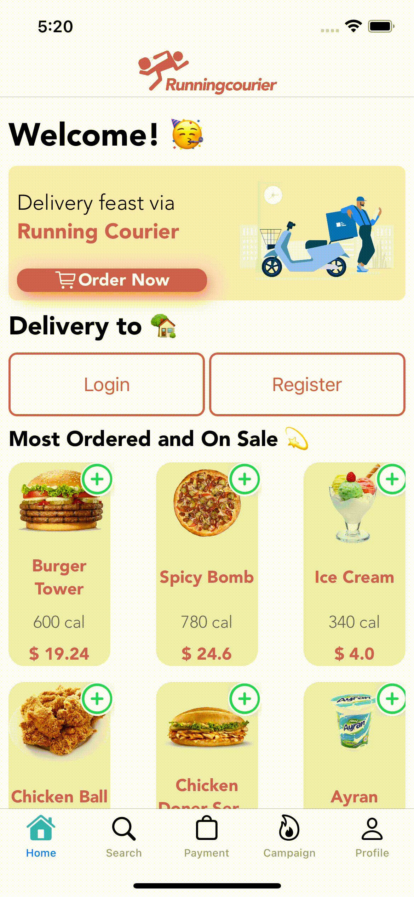
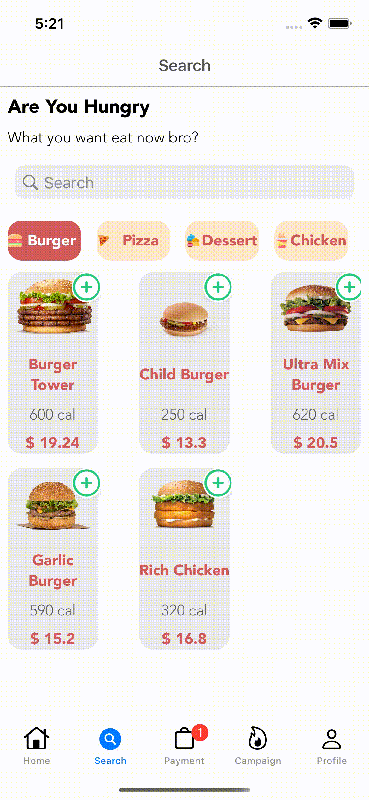
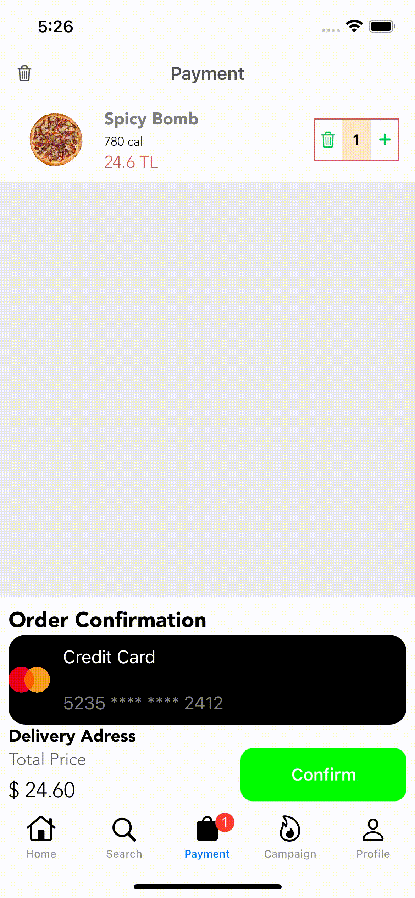
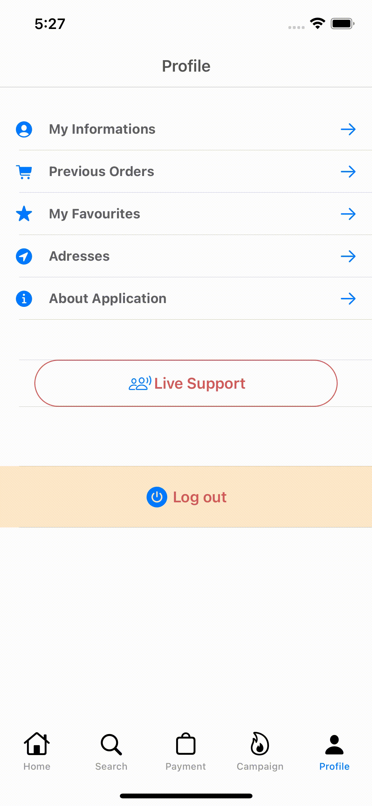

<h1 align="center">
  Courier Demo MVVM Project
</h1>

## 🪄 SUMMARY
Courier demo is an application that serves as a single company. It has membership features, ordering food, order history, automatic location finding, product detail features. This project was built using Swift on the front and node.js on the back.

## 🔍 PROJECT NOTES

- Resolution works very well on all devices.
- It's all done with programmaticly. Storyboards are not used.
- Component-based work.
- Backend and frontend were designed as a whole.
- Backend remote url: **https://runningcourierapi.herokuapp.com/**

## 🖥 TECHNOLOGIES & FRAMEWORK & PATTERNS

- Swift
- RxSwift
- Alamofire
- MVVM
- Nodejs
- Express
- MongoDB
- JWT
- Heroku

## 🔋 USAGE

### Example Credential :

- Email: example@gmail.com

- Password: 123

## Previews 

| Home Screen | Search Screen | Payment Screen | Product Detail Screen | Profile Screen |
| --- | --- | --- | --- | --- | 
|  |  |  |  |  | 

## License
```
Copyright (c) 2021 Fahreddin GÖLCÜK
```
